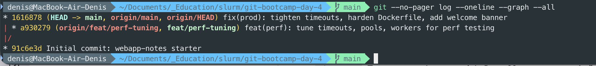
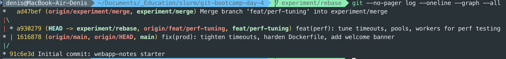
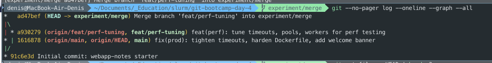
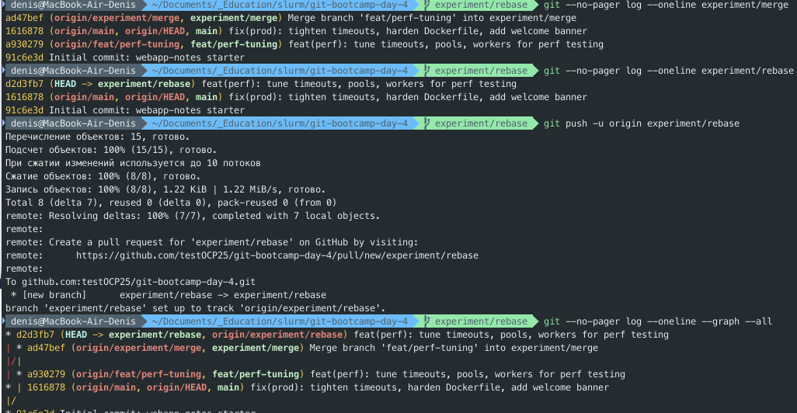
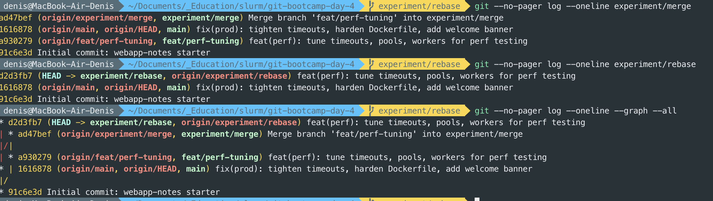
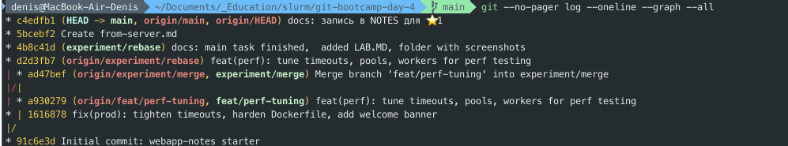
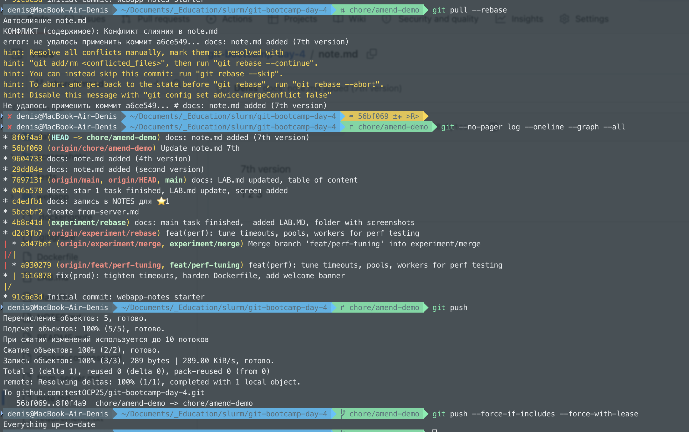
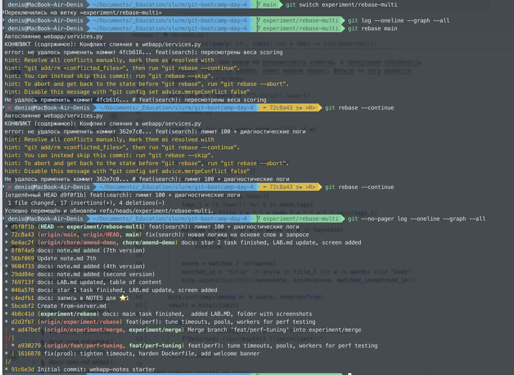
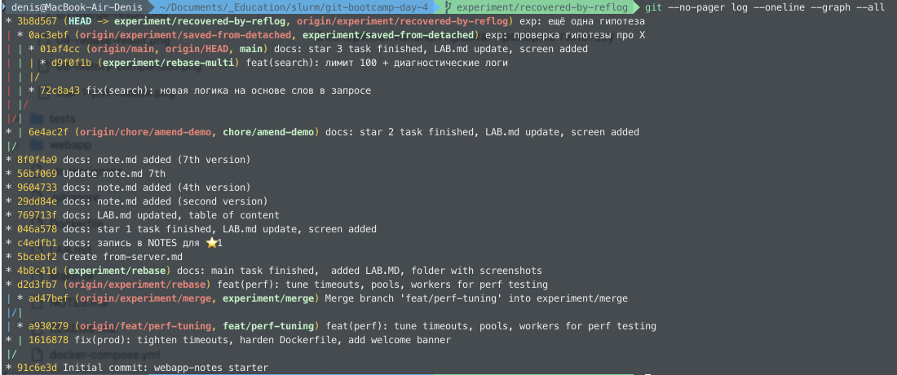

# LAB — день 4

> Это шаблон отчёта. Скопируйте его в `LAB.md` в корне вашего репозитория с ДЗ и заполните по ходу работы. Достаточно осмысленных заголовков, code-блоков с языком и ссылок на скриншоты.

Курс: [«Интенсив по погружению в GIT»](https://slurm.io/git-intensive)

## Содержание
- [LAB — день 4](#lab--день-4)
  - [Содержание](#содержание)
  - [Базовая задача — `01-merge-vs-rebase`](#базовая-задача--01-merge-vs-rebase)
    - [Стартовое состояние](#стартовое-состояние)
    - [Путь A — через `merge`](#путь-a--через-merge)
    - [Путь B — через `rebase`](#путь-b--через-rebase)
    - [Сравнение](#сравнение)
    - [Какой подход я бы выбрал(а) в команде и почему](#какой-подход-я-бы-выбрала-в-команде-и-почему)
  - [Задания со звездочкой (опционально)](#задания-со-звездочкой-опционально)
    - [⭐1 — `git pull` vs `git pull --rebase`](#1--git-pull-vs-git-pull---rebase)
    - [⭐2 — `--force-with-lease` vs `--force`](#2----force-with-lease-vs---force)
    - [⭐3 — rebase с конфликтом на каждом коммите](#3--rebase-с-конфликтом-на-каждом-коммите)
    - [⭐4 — безопасный выход из detached HEAD](#4--безопасный-выход-из-detached-head)


## Базовая задача — `01-merge-vs-rebase`

### Стартовое состояние

Были изменены файлы согласно заданию. Так как с первого раза не получилось сделать путь В, то второй раз не сильно заморачивался над состоянием файлов, была необходимость понять, как это выполнить задачу. В целом из-за этого пропустил один из скриншотов (надеюсь это не критично).


```bash
# git log --oneline --graph --all (на момент окончания подготовки)
```



### Путь A — через `merge`

Была создана отдельная ветка `experiment/merge`, все конфликты в файлах решал через VS Code Merge Editor, потому что это максимально наглядно и удобно. В первый заход пробовал как CLI, так и VS Code.

```bash
git switch -c feat/perf-tuning
git --no-pager log --oneline --graph --all
#изменение файлов в VS Code config.py services.py index.html Dockerfile
git add webapp/config.py webapp/services.py webapp/templates/index.html Dockerfile
git switch main
#изменение файлов в VS Code config.py services.py index.html Dockerfile
git add webapp/config.py webapp/services.py webapp/templates/index.html Dockerfile
git --no-pager log --oneline --graph --all
git switch -c experiment/merge
#Устранение конфликтов
git merge feat/perf-tuning
git add webapp/config.py webapp/services.py webapp/templates/index.html Dockerfile
git status
git commit
git --no-pager log --oneline --graph --all
git push -u origin experiment/merge
```


#Сам скрин ошибочный, удалил нормальный скрин в ходе откатов коммитов



### Путь B — через `rebase`

Вот тут самый большой вопрос возник, потому что задачу и метод выполнения не понял до конца.
Пришлось в решение подглянуть и не совсем разобрался, почему по заданию не нужен откат и почему оно так работает.

```bash
git switch main
git switch -c experiment/rebase feat/perf-tuning
git --no-pager log --oneline --graph --all
git rebase main
#Устранение конфликтов
git add webapp/config.py webapp/services.py webapp/templates/index.html Dockerfile
git rebase --continue
git push -u origin experiment/rebase
git --no-pager log --oneline --graph --all
```



### Сравнение

Финальная история всех веток рядом:



Что я заметил(а) в процессе сравнения:
- размер истории для merge больше, но больше и истории, и данных в логах, которые могут помочь при необходимости
- мне самому больше merge понравился, но, возможно, это из-за вопросов, которые вызвал у меня rebase
- наличие merge-коммита в ветке с rebase — для меня минус
- видна ли в истории ветка как сущность — видна, выделяется цветом, хотя мне нужно больше времени, чтобы разобраться с таким выделением


### Какой подход я бы выбрал(а) в команде и почему

На мой взгляд, лучше merge. Работать проще и история шире. Хотя я чувствую, что здесь недостаточно для меня информации и может быть примеров, как это работает в жизни

## Задания со звездочкой (опционально)
> это заполняете только если делали. иначе не включайте в отчет и удалите их шаблона

### ⭐1 — `git pull` vs `git pull --rebase`

Воспроизвел последовательность шагов в задании.
Сначала пройден Путь A — git pull. Но для выполения пришлось явно прописать `git config pull.rebase false`, иначе не проходил `git pull`.
История вышла большой и подрробной:
```bash
*   08a0574 (HEAD -> main) Merge branch 'main' of github.com:testOCP25/git-bootcamp-day-4
|\
| * 5bcebf2 (origin/main, origin/HEAD) Create from-server.md
* | 1bd118c docs: запись в NOTES для ⭐1
|/
* 4b8c41d (experiment/rebase) docs: main task finished,  added LAB.MD, folder with screenshots
* d2d3fb7 (origin/experiment/rebase) feat(perf): tune timeouts, pools, workers for perf testing
| * ad47bef (origin/experiment/merge, experiment/merge) Merge branch 'feat/perf-tuning' into experiment/merge
|/|
| * a930279 (origin/feat/perf-tuning, feat/perf-tuning) feat(perf): tune timeouts, pools, workers for perf testing
* | 1616878 fix(prod): tighten timeouts, harden Dockerfile, add welcome banner
|/
* 91c6e3d Initial commit: webapp-notes starter
```
Потом успешно откатившись и выполнив `git pull --rebase`, получил результат почишще:
```bash
* c4edfb1 (HEAD -> main) docs: запись в NOTES для ⭐1
* 5bcebf2 (origin/main, origin/HEAD) Create from-server.md
* 4b8c41d (experiment/rebase) docs: main task finished,  added LAB.MD, folder with screenshots
* d2d3fb7 (origin/experiment/rebase) feat(perf): tune timeouts, pools, workers for perf testing
| * ad47bef (origin/experiment/merge, experiment/merge) Merge branch 'feat/perf-tuning' into experiment/merge
|/|
| * a930279 (origin/feat/perf-tuning, feat/perf-tuning) feat(perf): tune timeouts, pools, workers for perf testing
* | 1616878 fix(prod): tighten timeouts, harden Dockerfile, add welcome banner
|/
* 91c6e3d Initial commit: webapp-notes starter
```
В целом явно видна разница в подходах, отдельно бы выделил, что в команды для каждого случая разные команды итоговые и во втором случае надо сделать `git push`.
настройку оставил в итоге для rebase:
`git config --global pull.rebase true`

Что было воспроизведено, какая разница в истории получилась, какую глобальную настройку поставили в `~/.gitconfig`.



### ⭐2 — `--force-with-lease` vs `--force`

Изменил файл, отправил на сервер, после чего еще раз изменил, сделал `git commit --amend`, при этом `git push` отказал, `git push --force-with-lease` безопаснее, чем `git push --force`, потому что он добавляет проверку: он не перезапишет удалённую ветку, если в ней появились новые коммиты, о которых ваша локальная копия не знает.
Попробовал с несколькими вариантами, локальными и удаленными изменениями. Думаю, что сам `git` достаточно мощшный инструмент и надо обязательно читать сообщения и проверять на удаленном ресурсе репозиторий.

Более умная проверка `--force-if-includes`. Она не отменяет, а дополняет проверку `--force-with-lease`, анализируя локальный reflog (журнал ссылок), чтобы выяснить: содержала ли  локальная ветка когда-либо тот коммит, который сейчас находится на сервере.



### ⭐3 — rebase с конфликтом на каждом коммите

Сюжет, через сколько `--continue` прошли, что почувствовали по сравнению с пассивным merge.



### ⭐4 — безопасный выход из detached HEAD

Как зашли в detached HEAD, какой коммит сделали, как выходили через `git switch -c`, чем `git reflog` помог как страховка.



